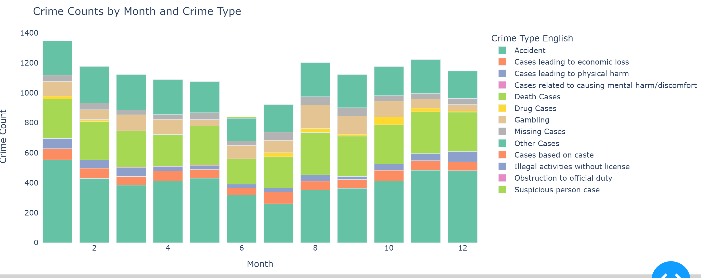

# Udupi Crime Report Dashboard



This is a web-based dashboard for visualizing crime data in Udupi, powered by Dash, Plotly, and Pandas.

## Table of Contents
- [Project Overview](#project-overview)
- [Getting Started](#getting-started)
  - [Prerequisites](#prerequisites)
  - [Installation](#installation)
- [Running the Dashboard](#running-the-dashboard)
- [Usage](#usage)
- [Dashboard Features](#dashboard-features)
- [Contributing](#contributing)
- [License](#license)

## Project Overview

The Udupi Crime Report Dashboard provides insights into crime data, including distribution by crime type, location, time of day, and more. Users can interact with the dashboard to explore and analyze crime data based on various criteria. This dashboard is built using Dash, a Python web application framework, and Plotly for interactive data visualization.

## Getting Started

### Prerequisites

To run the Udupi Crime Report Dashboard, you'll need the following software installed on your system:

- Python 3.x
- Pip (Python package manager)

### Installation

1. Clone the repository to your local machine:

   ```shell
   git clone https://github.com/your-username/udupi-crime-dashboard.git
   ```

2. Navigate to the project directory:

   ```shell
   cd udupi-crime-dashboard
   ```

3. Install the required Python packages:

   ```shell
   pip install -r requirements.txt
   ```

## Running the Dashboard

To run the Udupi Crime Report Dashboard, use the following command:

```shell
python app.py
```

The dashboard will be available in your web browser at `http://localhost:8050`. You can access it by opening this URL in your browser.

## Usage

The Udupi Crime Report Dashboard provides interactive features for users to analyze crime data. You can filter data by crime type, location, year, month, and time of day. The dashboard offers visualizations and insights based on your selected criteria.

## Dashboard Features

The dashboard includes the following features:

- **Crime Type Filtering**: Filter data by crime type(s).
- **Location Filtering**: Filter data by location(s).
- **Year Filtering**: Filter data by year(s).
- **Month Filtering**: Filter data by month(s).
- **Time of Day Filtering**: Filter data by time of day(s).
- **Crime Type Distribution**: View the distribution of crime types.
- **Location Distribution**: Explore where crimes are concentrated.
- **Yearly Trends**: Observe yearly crime trends.
- **Monthly Patterns**: Analyze monthly patterns of crimes.

## Contributing

We welcome contributions to this project. If you have suggestions, bug reports, or would like to add new features, please open an issue or create a pull request.

## License

This project is licensed under the [MIT License](LICENSE).

Enjoy exploring Udupi's crime data with the Udupi Crime Report Dashboard!
